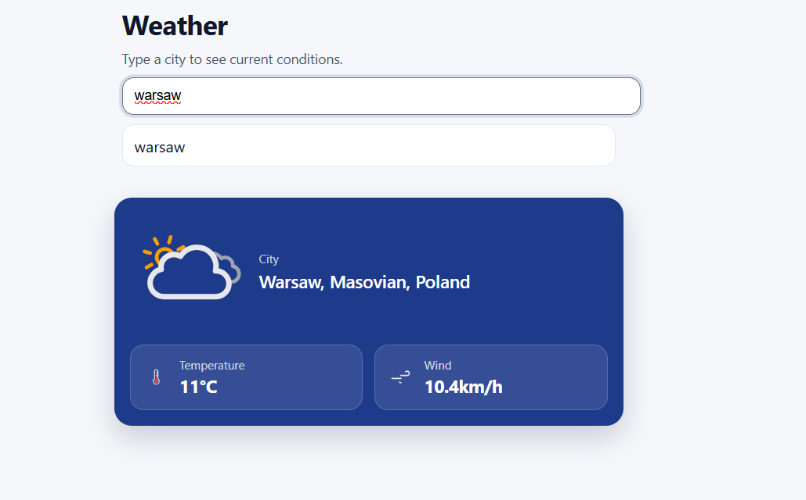

# 🌤️ Weather App

A minimal React weather app that shows current conditions for any city using free open-source APIs.

## 🚀 Live Demo

**Live demo:** https://majkan1.github.io/weather-app/

## 📸 Preview



---

## 🛠️ Tech Stack

- **React 18** — UI
- **JavaScript** — no TypeScript in this project
- **CSS** — custom styles in `App.css`
- **Open-Meteo API** — free weather data (no API key required)
- **Open-Meteo Geocoding API** — city name to coordinates

---

## 📁 Project Structure

```
src/
├── App.jsx              # All components and logic
├── App.css              # Styles
├── main.jsx             # Entry point
└── assets/
    └── all/             # Weather SVG icons
        ├── clear-day.svg
        ├── clear-night.svg
        ├── rain.svg
        ├── snow.svg
        ├── wind.svg
        ├── fog-day.svg
        ├── fog-night.svg
        ├── overcast-day.svg
        ├── overcast-night.svg
        ├── thunderstorms-day.svg
        ├── thunderstorms-night.svg
        ├── thermometer.svg
        └── not-available.svg
```

---

## ⚙️ Features

- Search any city by name
- **500ms debounce** — API is called only after you stop typing
- Displays:
  - City name, region, country
  - Dynamic weather icon (day/night aware)
  - Temperature (°C)
  - Wind speed (km/h)
- Fully **responsive** — adapts to mobile screens

---

## 🌐 APIs Used

| API | Usage | Auth |
|---|---|---|
| [Open-Meteo Geocoding](https://open-meteo.com/en/docs/geocoding-api) | City name → coordinates | None |
| [Open-Meteo Forecast](https://open-meteo.com/en/docs) | Current weather data | None |

Both APIs are completely free and require no API key.

---

## 📦 Installation

```bash
# Clone the repository
git clone https://github.com/your-username/your-repo-name.git

# Navigate to the project folder
cd your-repo-name

# Install dependencies
npm install

# Start the development server
npm run dev
```

App will be available at `http://localhost:5173`

---

## 🌡️ Weather Codes

The app maps WMO weather codes to icons:

| Code | Condition |
|---|---|
| 0 | Clear sky |
| 1–3 | Overcast |
| 45, 48 | Fog |
| 51–67 | Rain |
| 71–77, 85–86 | Snow |
| 95–99 | Thunderstorm |
| Wind ≥ 40 km/h | Wind (overrides icon) |

---

## 📄 License

MIT 
